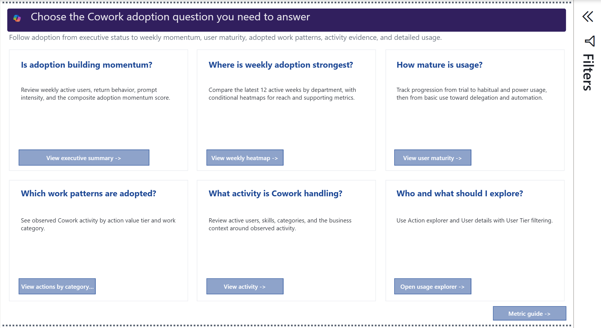
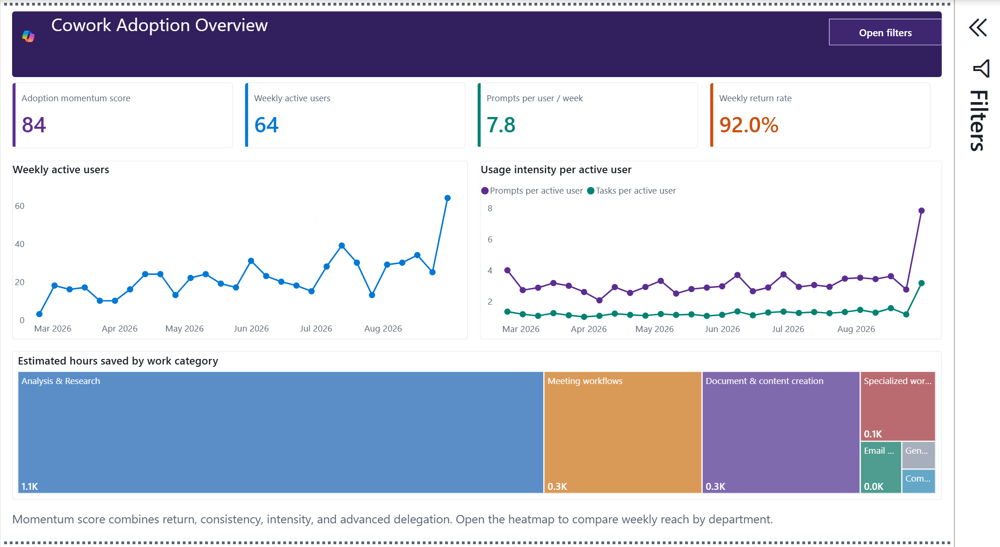
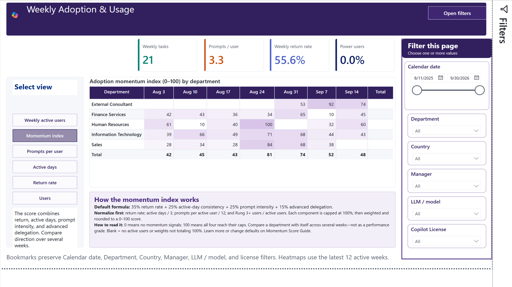
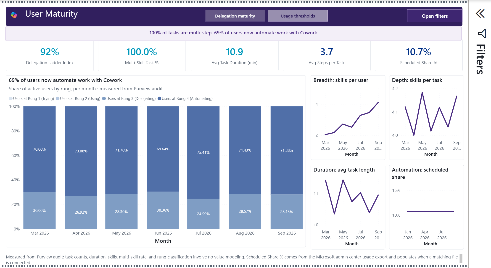
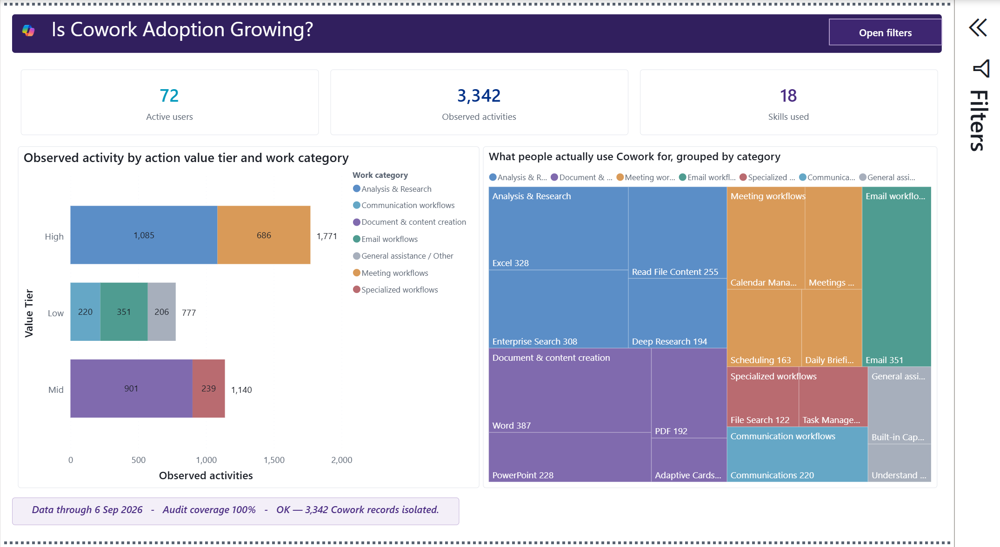
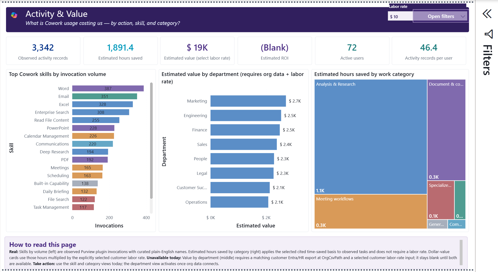
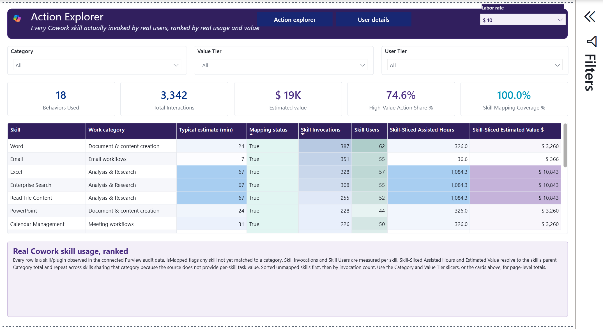
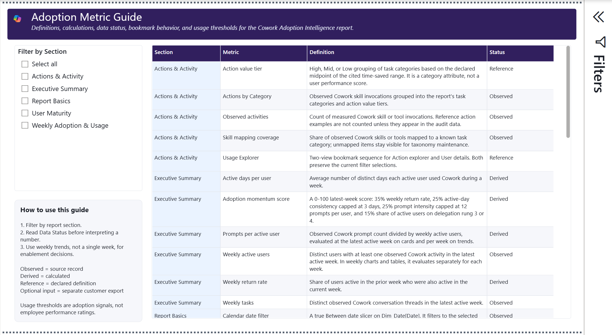

# Cowork Adoption Intelligence: interpretation guide

This guide explains the question each report page answers, how to read it, what
the signals may indicate, and what to verify before acting.

> The screenshots use fabricated sample data. They are not customer findings,
> targets, or benchmarks. Modeled hours and value depend on selected assumptions
> and must not be presented as observed savings.

## Five safeguards before interpretation

1. Confirm the reporting period and every active filter.
2. Check source availability in the report and the Adoption Metric Guide.
3. Distinguish observed, derived, reference, optional, and modeled values.
4. Compare trends and denominators before interpreting a single headline.
5. Protect user-level data and never use the report as a personnel scorecard.

## Metric confidence

| Label | Meaning | Safe wording |
| --- | --- | --- |
| Observed | Counted from a connected source field | "The connected export contains..." |
| Derived | Calculated from observed fields | "The report calculates..." |
| Reference | A declared definition, threshold, or interpretation rule | "The report defines..." |
| Optional input | Requires a separate customer-controlled export | "This is available when..." |
| Modeled | Observed activity combined with a cited assumption or customer input | "Under the selected assumptions..." |
| Unavailable | A required source or input is absent | "This cannot be calculated from the current inputs." |

## 1. Start Here

**Purpose:** Route a business question to the correct report page.

**How to read it:** Begin with the decision you need to make, not the largest
number. The cards separate adoption momentum, usage depth, potential champions,
work mix, modeled value, detailed investigation, and metric definitions.

**What this may indicate:** Different questions require different evidence.
Adoption can be measured from Purview activity even when optional organization,
usage, or model-attribution fields are unavailable.

**What to do next:** Select one route, then confirm the destination page's date
range, filters, and data-status notes before quoting a result.

## 2. Executive Summary

**Purpose:** Summarize the latest active week's adoption reach, consistency,
intensity, and delegation maturity.

**How to read it:** Read weekly active users (distinct users with observed
activity) and weekly tasks (distinct conversation threads) first, then prompts
per active user, active days per user, and weekly return rate. Return rate is the
share of prior-week active users who were also active in the current week. The
0-100 adoption momentum score combines:

- 35% weekly return rate
- 25% active-day consistency, capped at three days
- 25% prompt intensity, capped at 12 prompts per active user
- 15% share of active users on delegation rung 3 or 4

The score is a balanced index, not an external benchmark or product-health SLA.

**What this may indicate:** A rising score with broader active-user reach may
support continued enablement. High intensity with low return can indicate
one-time use rather than a sustained habit. A stable headline can also hide
different department or work-category patterns.

**What to do next:** Open Weekly Adoption & Usage to inspect the component trend.
State the latest active week, filter context, and component measures whenever
sharing the score.

## 3. Weekly Adoption & Usage

**Purpose:** Show whether Cowork use is growing, recurring, and distributed
across the latest 12 active weeks.

**How to read it:** Use the bookmarks to switch among usage overview, weekly
active users, adoption score, prompts per user, active days, and return rate.
The display window ends on the latest week containing observed Cowork activity.
Previous-week task volume is context, not part of the current-week total.
Darker heatmap cells indicate higher relative intensity within the filtered
visual; read the number for precision.

**What this may indicate:** Growth in active users with a steady or improving
return rate suggests broader recurring use. Rising prompts with falling active
users may indicate concentration among a smaller group. Department and country
comparisons are only as complete as the optional organization mapping.

**What to do next:** Investigate sharp changes against export coverage, holidays,
rollout timing, and filter changes. Use the same date and population when
comparing weeks.

## 4. User Maturity

**Purpose:** Describe how deeply users delegate work and how consistently they
use Cowork.

**How to read it:** The delegation ladder places active users on Trying, Using,
Delegating, or Automating rungs and scales the average position to a 0-100
index. Multi-skill task percentage is the share of observed threads invoking
more than one skill. Average task duration is elapsed time from the first to
last observed event in a thread, not measured human attention.

The rolling 12-week usage thresholds are:

| Tier | Definition |
| --- | --- |
| Power | At least 20 prompts per week on average and active in at least 9 weeks |
| Habitual | At least 8 prompts per week on average and active in at least 9 weeks |
| Novice | At least 1 prompt per week on average |
| Low | Some observed use below the Novice threshold |
| Inactive | No observed prompts in the window |

Scheduled share requires the optional Microsoft 365 admin center Cowork usage
export.

**What this may indicate:** More multi-skill work and higher delegation rungs can
signal deeper use. They can also reflect retries, long-running processes, or
workflow friction. Low activity does not establish lack of need or ability.

**What to do next:** Pair maturity results with role and work-category context.
Sample underlying threads or source records before describing activity as
complex or automated.

## 5. Cowork Champions

**Purpose:** Identify potential enablement champions and category or department
coverage gaps.

**How to read it:** A user must have at least three observed Cowork task threads
across at least two active weeks in the current date and category context. The
0-100 champion evidence score combines:

- 40% task-activity percentile
- 35% active-week consistency percentile
- 25% normalized delegation maturity

The selected tier returns the Top 5%, Top 10%, or Top 20% of eligible users
after deterministic tie-breaking; Top 10% is the default. Date and category
filters recalculate the evidence. Organization filters narrow the displayed
list. Department coverage requires the optional organization export.

**What this may indicate:** A high score shows comparatively strong, consistent
engagement and delegation evidence in the selected context. It does not prove
expertise, influence, willingness, business impact, or employee performance.

**What to do next:** Treat the list as a starting point for enablement outreach.
Confirm role fit, willingness, manager support, and appropriate data use before
contacting or naming anyone.

## 6. Actions by Category

**Purpose:** Explain what kinds of work users ask Cowork to perform.

**How to read it:** Observed skill and tool invocations are grouped into the
report's task categories. High, Mid, and Low action-value tiers use the declared
midpoint of each category's cited time-saved range. The tier is a reference
attribute, not measured value or a user-performance rating. Skill mapping
coverage shows how much observed activity maps to the maintained taxonomy.

**What this may indicate:** A broad work mix can show expansion into repeatable
workflows. Concentration can identify a strong scenario or a narrow adoption
pattern. Unmapped activity indicates taxonomy maintenance, not zero value.

**What to do next:** Review unmapped skills first. Validate the dominant
categories against source records and business context before recommending new
enablement scenarios.

## 7. Activity & Value

**Purpose:** Connect observed activity with transparent, assumption-based
estimates of assisted time and monetary value.

**How to read it:** Skill invocations and task volumes are observed. Assisted
hours are modeled as observed category task volume multiplied by the selected
Low, Mid, or High cited time-saved benchmark, divided by 60. Mid is used when no
single estimate basis is selected. Estimated monetary value equals assisted
hours multiplied by the customer-selected loaded labor rate; it remains
unavailable until a rate is selected.

Skill-level assisted hours and value use a category-grain allocation through
the selected skill. They are not per-skill metering, and category values can
repeat across multiple skills in the same category.

**What this may indicate:** High activity shows where Cowork is embedded. High
modeled value shows where the selected assumptions assign more assisted time;
it does not prove realized savings, causality, quality, or financial return.

**What to do next:** Confirm source citations, estimate basis, loaded labor rate,
and category mapping. Present Low, Mid, and High scenarios and label all value
figures as modeled.

## 8. Usage Explorer

**Purpose:** Trace headline totals to action and user-level patterns.

**How to read it:** Switch between Action explorer and User details. Both views
preserve the active report filters. Use the detail rows to understand dates,
skills, categories, users, and task patterns; the report does not inspect prompt
content or establish user intent.

**What this may indicate:** Repeated skills, concentrated activity, or unusual
durations can identify questions for investigation. A detail row is evidence of
recorded activity, not evidence of productivity, quality, or policy compliance.

**What to do next:** Corroborate anomalies in the approved originating system.
Limit user-level access and do not export identifiers into presentations,
issues, or unapproved locations.

## 9. Adoption Metric Guide

**Purpose:** Define the report's metrics, thresholds, source dependencies, and
interpretation boundaries.

**How to read it:** Filter by section and read each definition together with its
data status. Observed, Derived, Reference, and Optional input describe different
evidence types. An unavailable optional measure means its dependency is absent;
it does not mean the measured activity is zero.

**What this may indicate:** A metric can be mathematically correct but still
inappropriate for a decision if its period, population, source coverage, or
assumptions are not stated.

**What to do next:** Copy the metric definition, reporting period, filters, and
data-status label into presentations and decision records.

## Recommended decision language

| Scenario | Defensible wording |
| --- | --- |
| Adoption is broadening | "Weekly active users increased in the selected period while return rate remained stable or improved." |
| Use is concentrated | "Observed activity is concentrated among the displayed users or departments; role and rollout context should be checked." |
| Maturity is increasing | "The report calculates a higher delegation index and multi-skill share from observed task events." |
| Champion outreach | "These users meet the report's engagement evidence floor and selected percentile tier; role fit and willingness still require confirmation." |
| Value scenario | "Under the selected time-saved basis and labor rate, the report models the displayed assisted hours and value." |

Avoid wording that claims Cowork caused productivity gains, proves automation,
measures employee performance, or replaces official billing and compliance
records.

## Usage and compliance disclaimer

Coverage depends on licensing, audit settings, retention, product behavior,
permissions, export completeness, optional source availability, and identity
matching. The report can contain false positives, false negatives, incomplete
model attribution, and modeled estimates. It does not inspect prompt content,
prove intent, establish causality, replace official billing, or authorize
personnel action.

Customers control collection, storage, sensitivity labels, access, retention,
publication, and lawful use of their data. The repository's sample package is
fabricated and sends no customer data to GitHub.
