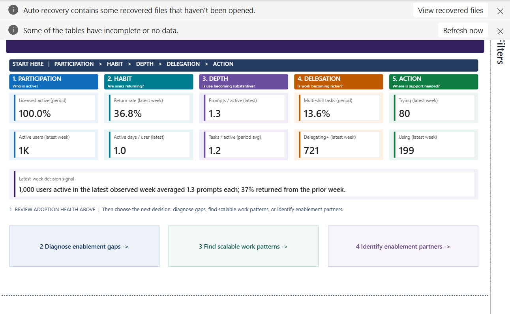

# Cowork Adoption Intelligence

> **Turn Microsoft 365 Copilot Cowork activity into an adoption, enablement, and
> capacity-planning view without processing audit rows in Power BI or Power
> Automate.**

[](CHANGELOG.md)
[](src/)
[](SECURITY.md)
[](automation/)

> [!IMPORTANT]
> **Template status: Testing.** Validate source coverage, definitions, assumptions,
> and rendered results before using the report for production decisions.

Cowork Adoption Intelligence is a data-free Power BI template for company-wide
Cowork administrators, adoption leaders, and enablement teams. A validated Python
preprocessor converts approved Microsoft Purview and supporting CSV exports into
13 deterministic entity CSVs. The report reads only those validated entities.

The recommended release has **9 pages, 284 visuals, and 27 bookmarks**. Start Here
guidance is intentionally integrated into **Cowork Adoption Scorecard** rather
than implemented as a separate page.



## Start in three steps

1. Download the
   [automation bundle](release/Cowork-Adoption-Intelligence-Automation-v0.1.0.zip)
   and the
   [fabricated sample package](release/Cowork-Adoption-Intelligence-Sample-Data.zip).
2. Generate and validate the entity files:

   ```powershell
   python .\container\Cowork_Purview_Preprocessor_v0.1.0.py `
     --input C:\CoworkAdoptionSample `
     --output C:\CoworkAdoptionPreprocessed

   python .\container\Validate-CoworkCompatibility.py `
     --output C:\CoworkAdoptionPreprocessed
   ```

3. Open
   [`Cowork Adoption V3.pbit`](Cowork%20Adoption%20V3.pbit),
   set `PreprocessedOutputPath` to `C:\CoworkAdoptionPreprocessed`, and select
   **Load**.

The sample is fabricated and uses only reserved example identities and URLs. See
[SETUP.md](SETUP.md) for production collection, validation, gateway, and
automation instructions.

## What the report answers

| Page | Business question |
| --- | --- |
| **Cowork Adoption Scorecard** | What is the current adoption position, what evidence supports it, and where should I go next? |
| **Weekly Adoption & Usage** | Are active users and task activity growing, recurring, or flattening? |
| **Adoption by Attributes** | Which available departments, roles, locations, or business units need different enablement? |
| **Scalable Work Patterns** | Which observed task patterns are repeatable and where is assisted capacity concentrated? |
| **Demand & Capacity Scenario** | How does observed demand compare with adjustable capacity assumptions? |
| **Adoption Maturity** | Are users progressing from first use toward sustained delegation and automation? |
| **Enablement Partners** | Which people show consistent category-level evidence for possible enablement outreach? |
| **Capacity Assumptions** | Which customer-controlled task and capacity assumptions drive scenario outputs? |
| **Adoption Metric Guide** | How is each metric defined and what are its interpretation limits? |

Enablement-partner results are signals for outreach, not employee-performance,
aptitude, promotion, or compensation ratings. Demand and capacity outputs are
adjustable scenarios, not forecasts, financial audits, or guaranteed savings.

## Supported data path

The current release has one required Power BI parameter:
`PreprocessedOutputPath`.

| Input | Required | What it adds |
| --- | --- | --- |
| Purview Audit Search CSV files | **Yes** | Cowork users, task threads, skills, resources, dates, and delegation evidence |
| Cowork usage details CSV | Recommended | Admin-center totals, active days, and scheduled/user-initiated reconciliation |
| Organization CSV | Optional | Department, business unit, role, manager, and geography |
| Identity enrichment CSV | Optional | Friendly display names for audit identities |
| Consumption CSV | Optional | Supporting consumption fields where available |

The preprocessor recursively discovers supported sources, validates the input
contract, filters `CopilotInteraction` records to Cowork, and atomically publishes
exactly 13 `entity-*.csv` files plus `manifest.json`.

## Automation architecture

```text
Power Automate recurrence
  -> start and monitor one Azure Container Apps Job
     -> PAX v1.11.15 collects bounded CopilotInteraction windows
     -> one protected raw CSV is appended and deduplicated on Azure Files
     -> the Cowork Python processor rebuilds 13 entity CSVs
     -> structural and compatibility validators must succeed
     -> the watermark and protected run status are published
  -> refresh Power BI only after the job succeeds
```

Power Automate is the orchestrator, not the audit-row processor. The cloud flow
does not loop through audit events or write them to Dataverse. This avoids
connector throttling, payload, duration, retention, and cost risks.

The automation implementation is under [`automation/`](automation/):

- [`automation/README.md`](automation/README.md) describes architecture,
  deployment, permissions, storage, performance evidence, and security.
- [`automation/power-automate/BUILD.md`](automation/power-automate/BUILD.md)
  defines the exact solution-aware cloud-flow actions and expressions.
- `CoworkRefreshOrchestrator.logic.json` is a machine-readable implementation
  map. It is **not** an importable Power Automate solution ZIP.
- [`automation/deploy/Deploy-CoworkAcaJob.ps1`](automation/deploy/Deploy-CoworkAcaJob.ps1)
  deploys the pinned container job and Azure Files mount.

## Release kit

| Resource | Path |
| --- | --- |
| Public, data-free Power BI template | [`Cowork Adoption V3.pbit`](Cowork%20Adoption%20V3.pbit) |
| Automation deployment bundle | [`release/Cowork-Adoption-Intelligence-Automation-v0.1.0.zip`](release/Cowork-Adoption-Intelligence-Automation-v0.1.0.zip) |
| Automation source | [`automation/`](automation/) |
| Fabricated sample package | [`release/Cowork-Adoption-Intelligence-Sample-Data.zip`](release/Cowork-Adoption-Intelligence-Sample-Data.zip) |
| Editable PBIP source | [`src/Cowork Adoption Intelligence - Recommended Layout.pbip`](src/Cowork%20Adoption%20Intelligence%20-%20Recommended%20Layout.pbip) |
| Page renders | [`images/report-pages/`](images/report-pages/) |
| Interpretation guide | [`INTERPRETATION_GUIDE.md`](INTERPRETATION_GUIDE.md) |
| Release evidence | [`docs/RELEASE_CHECKLIST.md`](docs/RELEASE_CHECKLIST.md) and [`docs/RELEASE_VERIFICATION.json`](docs/RELEASE_VERIFICATION.json) |

Previous raw-Purview and SharePoint V4.0 templates remain in
[`release/archive/`](release/archive/) for rollback reference only. They are not
the current report, source, or automation path.

## Repository structure

```text
Cowork Adoption V3.pbit
automation/
  container/
  deploy/
  power-automate/
docs/
images/report-pages/
release/
  archive/
  Cowork-Adoption-Intelligence-Automation-v0.1.0.zip
  Cowork-Adoption-Intelligence-Sample-Data.zip
sample_data/
src/
  Cowork Adoption Intelligence - Recommended Layout.pbip
  Cowork Adoption Intelligence.Report/
  Cowork Adoption Intelligence.SemanticModel/
```

## Security and privacy

The distributable template contains no imported customer data. It carries the
tenant **Public** sensitivity label without encryption and includes the
Desktop-generated `SecurityBindings` stream associated with that label. Do not
remove or replace package streams manually.

Production audit, organization, identity, generated entity, manifest, log, and
report data can contain personal and business information. Keep them outside the
repository, restrict access, and never attach them to issues or pull requests.
Read [SECURITY.md](SECURITY.md) before using production data.

## Interpretation boundaries

- Purview coverage depends on licensing, retention, permissions, and emitted
  fields.
- Optional Microsoft 365 usage files are aggregates, not event timelines.
- Task duration is elapsed time between observed events, not measured human
  attention.
- Capacity and assisted-time results combine observed activity with editable
  assumptions; they are scenarios, not realized savings or ROI.
- Enablement-partner signals require role fit, willingness, manager support, and
  human review.

See [INTERPRETATION_GUIDE.md](INTERPRETATION_GUIDE.md) for page-by-page reading
order, actions, and guardrails.

## Release status

The current release is **5.0.0-testing**. Review the
[changelog](CHANGELOG.md), [release checklist](docs/RELEASE_CHECKLIST.md), and
[verification manifest](docs/RELEASE_VERIFICATION.json) before distribution.

For problems, open a
[GitHub issue](https://github.com/microsoft/Cowork-Adoption-Intelligence/issues)
without attaching tenant exports, credentials, customer identifiers, or
identifiable screenshots.

## License

This project is licensed under the [MIT License](LICENSE).

## Trademarks

This project may contain Microsoft trademarks or logos. Use of Microsoft
trademarks or logos must follow
[Microsoft's Trademark and Brand Guidelines](https://www.microsoft.com/legal/intellectualproperty/trademarks).
Modified versions must not cause confusion or imply Microsoft sponsorship.
